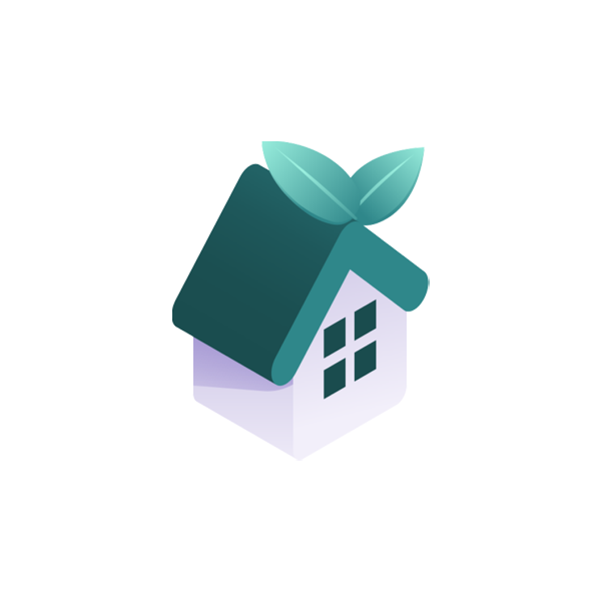

# Nha Gia Re

- **Introduce the application:**

  - "Nha gia re" is an application designed to help property buyers or renters search for and select real estate based on their needs. The application assists users in finding the most suitable properties according to their requirements and connects them with individuals or real estate agents looking to list their properties conveniently and easily.

  - "Nha gia re" offers basic functions such as property search, chatting with real estate agents, posting property listings, and viewing real estate-related blogs, among others.

- **List of Features:**
  - Post real estate listings.
  - Search for real estate near you.
  - Search for real estate by location.
  - Contact the listing owner.
  - Manage your listings.
  - Manage user accounts.
  - Subscribe to a pro listing package.

## Screenshots

<p align="center">
  
  
  
  
  
</p>
<p align="center">
  
  
  
  
  
</p>
<p align="center">
  
  
  
  
  
</p>

## Getting Started

To run any Android application built with Flutter you need to configure the enviroments in your machine, you can do this following the the tutorial provided by Google in [Flutter website](https://flutter.dev/docs/get-started/install)

- Flutter SDK
- Android Studio (to download Android SDK)
- Xcode (for iOS develop only)
- Any IDE with Flutter SDK installed (ie. IntelliJ, Android Studio, VSCode etc)
- A little knowledge of Dart and Flutter

## Technologies

- Flutter
- Clean Architecture
- GetX
- API with NodeJS backend and Postgre Database

## Setup

1. Clone the repository
2. Open the project in your preferred IDE (e.g. Android Studio, VS Code)
3. Run `flutter pub get` to install the required dependencies
4. Run the project in an emulator or on a physical device

# Project stucture

```
// Directory structure for assets and app
- assets
  - lotties: contains lotifile and animate files
  - icons : contains icon images for usage
  - images: contains app images
  - fonts : contains app fonts (you can using GoogleFont package)

- cofig:
    - theme: contains app theme (theme, colors, text styles, etc.)
    - languages: contains app translation (en, vi, etc.)
    - values: contains app values ( strings, image assets)
    - routes
        - app_pages.dart: routes to corresponding pages
        - app_routes.dart: contains names of routes
- core:
    - constants: contains common constants for app (api, etc.)
    - errors: contains error handling (exceptions, failure, etc.)
    - extensions: contains extensions for values in app ( String, DateTime, etc.)
    - network: contains network information (check internet connection, etc.)
    - resources: contains common resources (assets, abstart class of state, etc.)
    - usecases: abstract class for usecases
    - utils: contains common utility functions for app
    - services: implement services for app
- features:
    - data:
        - db: contains database (API, database, firebase, etc.)
        - datasources: contains data sources (local, remote, etc.)
        - models: contains models for data
        - repositories: contains repositories for data
    - domain: contains domain layer (entities, usecases, etc.)
        - enums: contains self-defined enums
        - entities: contains entities for domain
        - repositories: contains repositories for domain
        - usecases: contains usecases for domain
    - presentation: contains presentation layer (pages, widgets, blocs, etc.)
        - global_widgets: contains frequently used widgets in the app
        - <module_name>: named after the functional name
            - screens: contains pages for the feature
            - widgets: contains local widgets only used in this feature
            - <module_name>\_controller.dart: Initializes controller for the feature
            - <module_name>\_binding.dart: Defines functions and variables for controller
- injection_container.dart: contains dependency injection
- main.dart
```

# References

[Server backend](https://github.com/nhao2003/nha_gia_re_server)

[Design Figma](https://www.figma.com/file/0sRUPVgCitxAlJ73PnC048/NHAGIARE?type=design&node-id=1-34419&mode=design&t=gCwDIAaeSUXDQSJY-0)
